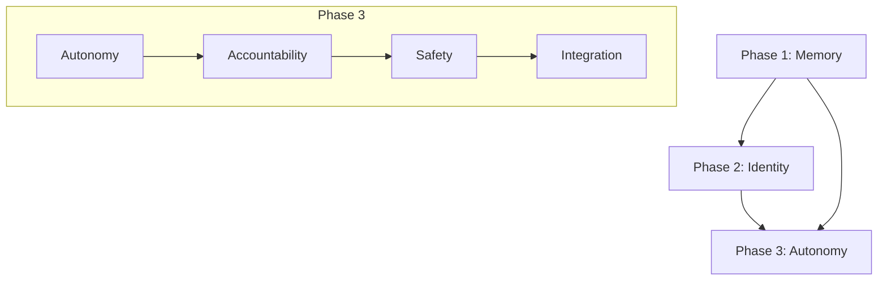

# Phase 3: Autonomy & Accountability Implementation Plan

## Overview
Phase 3 builds on the foundation of Phase 1's memory system and Phase 2's enhanced identity to create a robust framework for autonomous operation with clear accountability guardrails.

## 1. Autonomy Mechanisms

### 1.1 Enhanced Heartbeat System
```json
{
  "components": {
    "core": {
      "interval": "30m",
      "checks": ["memory", "tasks", "system", "external"]
    },
    "proactive": {
      "memory_consolidation": "daily",
      "status_reports": "weekly",
      "health_checks": "hourly"
    }
  },
  "implementation": {
    "heartbeat.json": {
      "last_check": "timestamp",
      "next_check": "timestamp",
      "status": "enum[OK|WARNING|ERROR]",
      "checks": ["array of completed checks"]
    }
  }
}
```

### 1.2 Scheduled Task Framework
```json
{
  "scheduler": {
    "cron": {
      "memory_consolidation": "0 0 * * *",
      "health_check": "0 * * * *",
      "status_report": "0 0 * * 0"
    },
    "recurring": {
      "update_check": "4h",
      "backup": "24h",
      "cleanup": "168h"
    }
  },
  "task_definition": {
    "name": "string",
    "schedule": "cron|interval",
    "priority": "1-5",
    "timeout": "duration",
    "retry": "policy"
  }
}
```

### 1.3 Project Monitoring
- Status dashboard in `status/dashboard.md`
- Real-time metrics in `metrics/*.json`
- Trend analysis in `analysis/trends.md`

### 1.4 Autonomy Protocols
```yaml
initiative_levels:
  L1_basic:
    - File organization
    - Documentation updates
    - Memory consolidation
  L2_operational:
    - Task scheduling
    - Resource optimization
    - Error recovery
  L3_decision:
    - Task prioritization
    - Resource allocation
    - Risk assessment
  L4_strategic:
    - Project planning
    - Performance optimization
    - System evolution
```

## 2. Accountability System

### 2.1 SCOPE.md Structure
```markdown
# SCOPE.md

## Operational Boundaries
- Allowed actions
- Restricted actions
- Prohibited actions

## Decision Authority
- Autonomous decisions
- Consultation required
- Human approval required

## Resource Limits
- Memory usage
- API rate limits
- Storage quotas

## Interaction Protocols
- Direct communication
- Async operations
- Emergency procedures
```

### 2.2 Approval Matrix
```json
{
  "actions": {
    "file_ops": {
      "read": "autonomous",
      "write": "autonomous",
      "delete": "approval_required"
    },
    "system_ops": {
      "status": "autonomous",
      "config": "consultation",
      "restart": "approval_required"
    },
    "external_ops": {
      "query": "autonomous",
      "modify": "approval_required",
      "publish": "approval_required"
    }
  }
}
```

### 2.3 Error Reporting System
```yaml
error_levels:
  notice:
    action: log
    notify: false
  warning:
    action: log|retry
    notify: true
  error:
    action: log|notify|pause
    escalate: true
  critical:
    action: log|notify|stop
    escalate: immediate
```

### 2.4 Performance Framework
```json
{
  "metrics": {
    "reliability": ["uptime", "error_rate", "response_time"],
    "efficiency": ["task_completion", "resource_usage"],
    "quality": ["accuracy", "user_satisfaction"],
    "autonomy": ["self_resolved", "escalation_rate"]
  },
  "review_schedule": {
    "daily": ["basic_metrics"],
    "weekly": ["detailed_analysis"],
    "monthly": ["trend_analysis", "improvement_plans"]
  }
}
```

## 3. Safety Rails

### 3.1 SAFETY.md Structure
```markdown
# SAFETY.md

## Core Principles
1. Do no harm
2. Protect privacy
3. Maintain security
4. Ensure reversibility
5. Practice transparency

## Operational Guidelines
- Data handling
- Command execution
- External communication
- Resource management

## Emergency Procedures
- Stop conditions
- Recovery processes
- Incident response
- Human escalation
```

### 3.2 Trust Ladder
```yaml
trust_levels:
  L0_restricted:
    permissions: [read_public]
    requires: initial_setup
  L1_basic:
    permissions: [read_all, write_logs]
    requires: 24h_stable
  L2_standard:
    permissions: [read_all, write_safe, exec_basic]
    requires: 7d_stable
  L3_trusted:
    permissions: [read_all, write_all, exec_standard]
    requires: 30d_stable
  L4_autonomous:
    permissions: [read_all, write_all, exec_all]
    requires: 90d_stable
```

### 3.3 Emergency Stop System
```json
{
  "triggers": {
    "system": ["resource_exceeded", "error_threshold", "security_breach"],
    "operational": ["task_failure", "data_anomaly", "permission_violation"],
    "manual": ["user_command", "watchdog_signal"]
  },
  "actions": {
    "soft_stop": ["pause_tasks", "save_state", "notify"],
    "hard_stop": ["terminate_tasks", "emergency_save", "notify"]
  }
}
```

### 3.4 Audit System
```yaml
audit_trail:
  storage:
    format: append-only
    retention: 90d
    backup: daily
  events:
    - timestamp
    - action
    - context
    - result
    - signature
  reports:
    daily: basic_summary
    weekly: detailed_analysis
    monthly: compliance_check
```

## 4. Integration Plan

### 4.1 Phase Dependencies


### 4.2 Implementation Sequence
1. **Week 1-2: Core Framework**
   - Deploy enhanced heartbeat
   - Implement SCOPE.md
   - Create basic safety rails

2. **Week 3-4: Monitoring & Control**
   - Deploy task scheduler
   - Implement audit system
   - Setup monitoring dashboard

3. **Week 5-6: Safety & Accountability**
   - Implement trust ladder
   - Deploy emergency stops
   - Create performance metrics

4. **Week 7-8: Integration & Testing**
   - System integration
   - Full testing cycle
   - Documentation & training

### 4.3 Testing Strategy
```json
{
  "unit_tests": {
    "components": ["heartbeat", "scheduler", "monitor"],
    "coverage": "95%",
    "automation": "continuous"
  },
  "integration_tests": {
    "scenarios": ["normal_ops", "error_handling", "recovery"],
    "frequency": "daily",
    "coverage": "85%"
  },
  "system_tests": {
    "scenarios": ["full_cycle", "stress", "security"],
    "frequency": "weekly",
    "duration": "24h"
  }
}
```

## 5. Success Metrics

### 5.1 Operational Metrics
- Autonomy rate: >80%
- Error recovery: >95%
- Response time: <2s
- Availability: 99.9%

### 5.2 Quality Metrics
- Decision accuracy: >95%
- User satisfaction: >90%
- Documentation coverage: 100%
- Test coverage: >90%

### 5.3 Safety Metrics
- Security incidents: 0
- Data loss events: 0
- Unauthorized actions: 0
- Recovery time: <15m